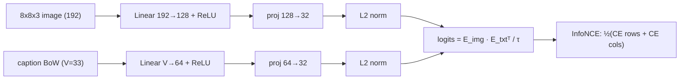

# ai-learn-12-multimodal-clip-scratch

Day 12 of the AI learning track. This is a **toy CLIP** built from scratch in NumPy. Two encoders (image and text) with projection heads are trained using a symmetric **InfoNCE** contrastive loss. The model is then tested on cross-modal retrieval and zero-shot classification. There are no deep-learning frameworks, no network access and no pretrained weights. The full run takes about 1.5 s on CPU with seed 42.

## What you'll learn

- How CLIP-style contrastive learning works: an N×N similarity matrix, temperature τ, and cross-entropy along both rows (image to text) and columns (text to image).
- How to backprop by hand through a 2-layer MLP **and an L2-normalisation layer**: `dz = (de - e·(e·de)) / ||z||`.
- How to evaluate retrieval with **recall@k**, and the difference between *instance* recall and *concept* recall when a dataset has near-duplicate captions.
- How **zero-shot classification** works using only text prompts ("a photo of a circle"), how **prompt ensembling** over synonyms helps, and how to check compositional generalisation on colour-shape combos never seen in training.

## Data

- **Images:** 8×8×3 arrays drawn procedurally (`data.py`). There are 4 shapes (square, circle, triangle, cross), 4 colours and 2 sizes, which gives 32 concepts. Each image gets random position, colour jitter and pixel noise.
- **Captions:** 4 templates combined with synonyms ("big crimson box", "the ring is navy and tiny") and encoded as bag-of-words.
- **Held-out combos:** yellow triangle, blue cross, red circle and green square never appear in training. They are used only for evaluation.

## Architecture



## Layout

| file | purpose |
|---|---|
| `data.py` | shape renderer, caption templates and synonyms, dataset splits, BoW vocab |
| `clip.py` | encoders, L2-norm backprop, symmetric InfoNCE, Adam, training loop, recall@k |
| `run_smoke.py` | end-to-end run: train, evaluate retrieval and zero-shot, write `results/` |
| `smoke_plots.py` | SVG plots and `RESULTS.md` writer |
| `svg_utils.py` | SVG minifier (keeps plots small and diff-friendly) |
| `notebooks/clip_scratch.ipynb` | step-by-step walkthrough |
| `results/` | `RESULTS.md`, `metrics.json`, `JSON.shot`, `*.svg` from the real smoke run |

## Run

```bash
pip install -r requirements.txt
python run_smoke.py        # ~1.5 s, rewrites results/
```

## Headline results (seed 42, see `results/RESULTS.md`)

These numbers are from the committed smoke run. `results/metrics.json` has every number.

- InfoNCE loss falls from 3.64 to 0.46 (chance is log 64 = 4.16).
- Test concept-level recall@1: image→text 66.5% and text→image 71.0%, against 4.0% for random scores. Recall@5: 89.0% and 94.5%.
- Zero-shot 4-way accuracy with prompt ensembling: shape 66.5% and colour 88.5% (chance 25%). On held-out colour-shape combos, shape accuracy is 75.0%.

## Limitations

This is a teaching toy. The encoders are MLPs (not CNNs or ViTs), the captions are bag-of-words (word order is ignored), τ is fixed rather than learned, and the data is synthetic.
